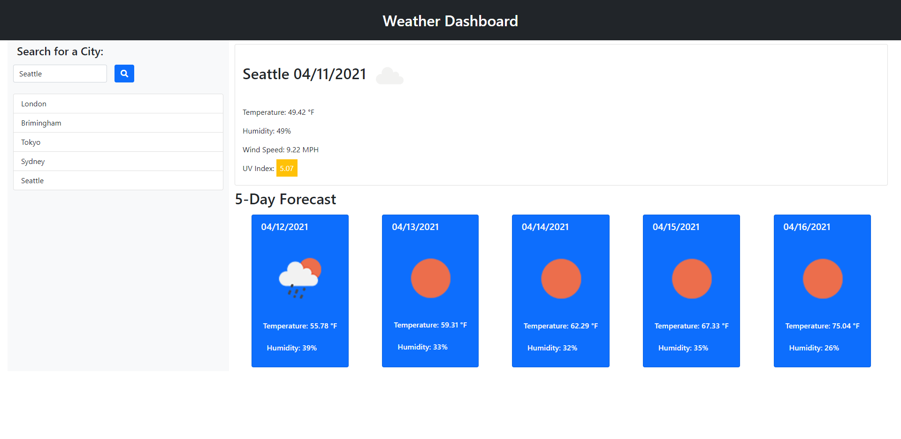
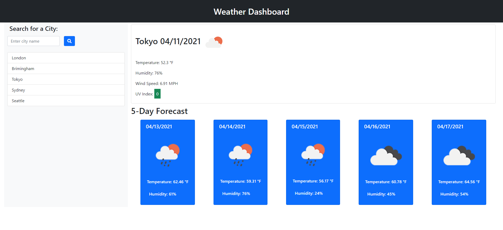

# Weather Dashboard

## Description

As a developer I was tasked with building an app that displays current weather and a 5 day forecast

- When a you search for a city, the current conditions are displayed and the city is added to history and to local storage;
- When displaying information for a city, the user can see the City Name, the Date, an icon representing weather conditions, Temperature, Humidity, Wind Speed and the UV Index;
- The UV Index is sat on a background color indicating whether the conditions are favorable (green background), moderate (yellow background) or severe (red background);
- Upon searching for a city or selecting a city from history, user is presented with the 5-day Forecast for that respective city;
- The 5-day Forecast displays the date, an icon representing weather conditions, Temperature and the Humidity;
- When selecting a city from the search history, user will be presented with the current conditions as well as the 5-day Forecast;

## Screenshots

## Link to deployed application

You can access the deployed application [here](https://ttudorandrei.github.io/weather_dashboard/)

## Link to Github repository

You can access the Github repository [here](https://github.com/ttudorandrei/weather_dashboard)
